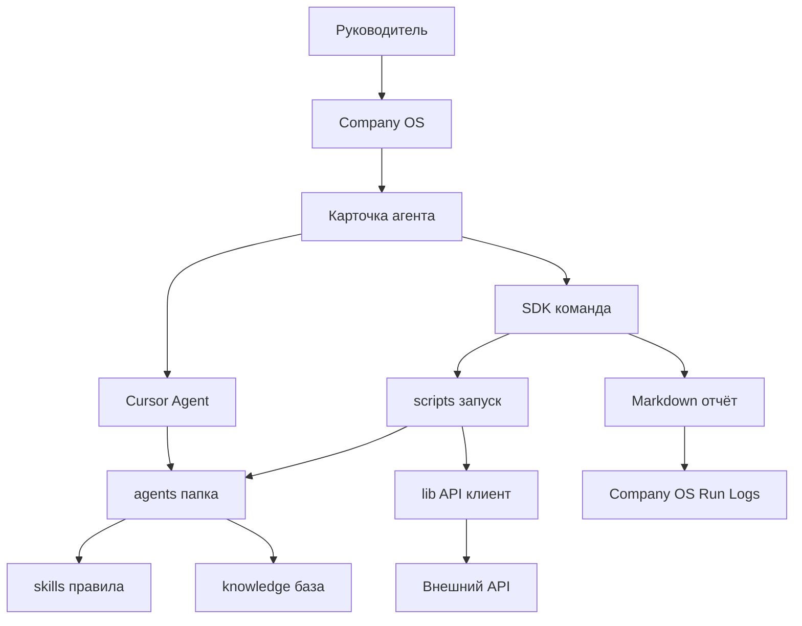

# Архитектура агентов

Этот документ объясняет, где что лежит в `agent-lab` и как не превращать агентов в black box.

## Главная идея

Каждый агент должен быть понятен как небольшой внутренний продукт: у него есть цель, входные данные, правила, команда запуска, отчёт и критерии качества.

Разницу между агентами и skills см. в [agents-vs-skills.md](agents-vs-skills.md).

## Роли папок

```text
agent-lab/
├─ agents/          # паспорта агентов: README, prompt, config, checklist
├─ skills/          # знания и правила, которые агент должен применять
├─ lib/             # технические клиенты и общие функции
├─ scripts/         # короткие команды запуска
├─ docs/            # инструкции для человека
├─ data/            # кеши и временные данные
└─ package.json     # список команд npm
```

Рядом с проектом находится Obsidian vault:

```text
Company OS/
├─ Agents/          # карточки агентов для управления
├─ Run Logs/        # отчёты запусков
├─ Decisions/       # решения по архитектуре и правилам
└─ Playbooks/       # регулярные сценарии работы
```

## Поток работы агента




## Паспорт агента

Каждый агент получает папку:

```text
agents/<agent-name>/
├─ README.md
├─ prompt.md
├─ config.example.json
└─ eval-checklist.md
```

`README.md` отвечает на вопрос «зачем агент нужен».  
`prompt.md` хранит основную инструкцию.  
`config.example.json` показывает, какие параметры и секреты нужны.  
`eval-checklist.md` помогает оценивать качество результата после каждого запуска.

## Что считается хорошим агентом

- Его можно запустить одной командой.
- Он не требует копировать секреты в чат.
- Он пишет отчёт в `Company OS/Run Logs/`.
- Он логирует `agentId`, `runId`, дату, статус и версию prompt.
- У него есть checklist качества.
- Его можно улучшать через изменения `prompt.md`, `SKILL.md` или конфига.

## Цикл улучшения

1. Запустить агента.
2. Открыть отчёт в Obsidian.
3. Проверить отчёт по `eval-checklist.md`.
4. Записать замечания.
5. Изменить prompt, skill или источник данных.
6. Повторить запуск на тех же или сопоставимых данных.
7. Сравнить качество отчётов.

## Синхронизация с Company OS

`agent-lab` — источник правды по устройству агента.

`Company OS` — пользовательская витрина: с неё руководитель начинает работу и смотрит историю.

Поэтому синхронизация входит в Definition of Done для изменений агентов:

1. Создали нового агента в `agents/` — создайте карточку `../Company OS/Agents/<agent-name>.md`.
2. Существенно изменили назначение, сценарии, способ запуска или ограничения агента — обновите его карточку в `Company OS/Agents/`.
3. Провели реальный запуск — сохраните результат в `Company OS/Run Logs/` или убедитесь, что SDK сделал это автоматически.
4. Приняли правило или архитектурное решение — зафиксируйте его в `Company OS/Decisions/`.
5. Появился регулярный процесс — оформите playbook в `Company OS/Playbooks/`.

Пользователь не должен помнить об этой синхронизации отдельно. Если агент меняется в `agent-lab`, исполнитель изменения должен сразу обновить соответствующую витрину в `Company OS`.

