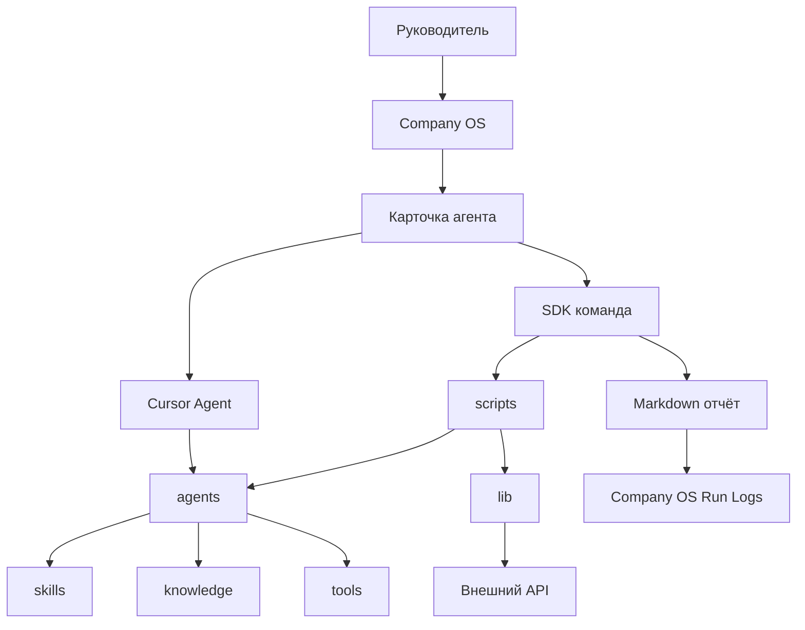

# Архитектура агентов

Этот документ объясняет, где что лежит в `agent-lab` и как не превращать агентов в black box.

## Главная идея

Каждый агент — небольшой внутренний продукт: цель, входы, правила, запуск, отчёт и критерии качества.

Разницу между агентами и skills см. в [agents-vs-skills.md](agents-vs-skills.md).

## Роли папок

```text
agent-lab/
├─ agents/              # паспорта: README, prompt, config, eval-checklist
│  └─ draft/            # черновики до первого полезного результата
├─ skills/              # методики (SKILL.md, reference, guide, examples)
│  └─ attribution/      # только учёт внешних источников чужих skills
├─ knowledge/           # глубокая база и книжные выжимки
├─ tools/               # внутренний исполняемый код (генераторы, CLI)
├─ lib/                 # общие модули для SDK и API
├─ scripts/             # npm-команды и автоматические запуски
├─ docs/                # инструкции для людей
├─ data/                # кеши (не коммитить чувствительное)
└─ outputs/             # примеры артефактов агентов
```

Рядом — Obsidian vault **Company OS** (карточки, Run Logs, Decisions, Playbooks; зеркало `skills/`, `knowledge/`, `tools/` по необходимости).

## Куда класть новый материал

| Что добавляете | Куда |
| -------------- | ---- |
| Роль агента, сценарии, чеклист | `agents/<name>/` |
| Правила работы, шаблоны ответов | `skills/<name>/` |
| Длинные методички, книги, карты процессов | `knowledge/<topic>/` |
| Python/CLI, PPTX-шаблоны, assets генератора | `tools/<name>/` |
| Адаптация skill с GitHub | `skills/<name>/` + запись в `skills/attribution/` |
| Регулярный отчёт, API, cron | `scripts/` + `lib/` |

**Не используйте** отдельную папку `vendor/` для своих агентов — исторически так называли копии вне репозитория; канон теперь в `tools/` и `skills/`.

## Поток работы



## Паспорт агента

```text
agents/<agent-name>/
├─ README.md
├─ prompt.md
├─ config.example.json
└─ eval-checklist.md
```

## Что считается хорошим агентом

- Запуск понятен из карточки Company OS и паспорта.
- Секреты не копируются в чат.
- Важные запуски попадают в `Company OS/Run Logs/`.
- Есть `eval-checklist.md`.
- Улучшения идут через `prompt.md`, skill или конфиг.

## Цикл улучшения

1. Запустить агента.
2. Проверить по `eval-checklist.md`.
3. Обновить prompt / skill / tools при необходимости.
4. Обновить карточку в `Company OS/Agents/`.
5. Повторить на сопоставимых данных.

## Синхронизация с Company OS

`agent-lab` — источник правды. `Company OS` — витрина для руководителя.

Definition of Done при изменении агента:

1. Паспорт в `agents/` (или `agents/draft/`).
2. Карточка в `Company OS/Agents/` или `Agents/Draft/`.
3. При изменении skills/knowledge/tools — обновить зеркало в vault (см. `Company OS/README.md`, `rsync`).
4. Значимый запуск — запись в `Run Logs/`.
