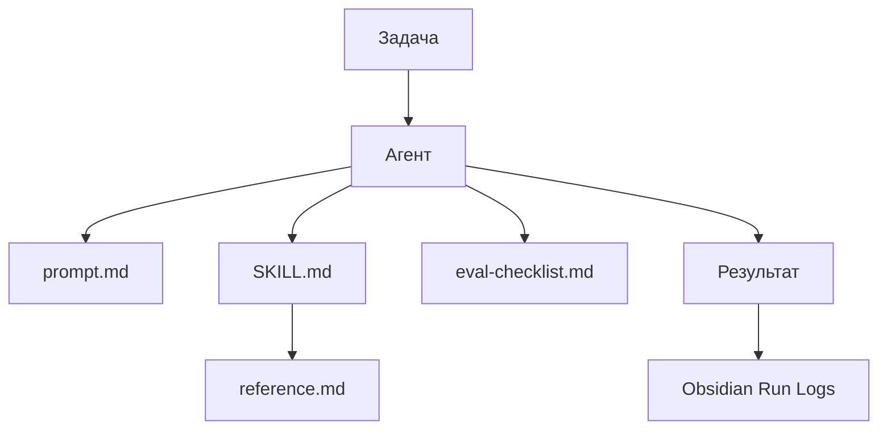

# Agents vs Skills

Этот документ объясняет разницу между агентами и skills в `agent-lab`.

## Коротко

Агент — это кто делает работу.

Skill — это методика, по которой он работает.

Пример:

```text
spreadsheet-maker = агент, который создаёт управленческие Excel-книги
excel-workbook-generation = skill, который описывает правила создания качественных .xlsx
```

## Что такое агент

Агент — это рабочая роль или внутренний мини-продукт.

Агент отвечает на вопросы:

- какую работу он выполняет;
- для кого;
- какие входные данные принимает;
- какой результат должен выдать;
- как его запускать;
- как проверить качество результата;
- нужен ли ему Cursor SDK.

В проекте агенты лежат здесь:

```text
agents/<agent-name>/
```

Стандартная структура:

```text
agents/<agent-name>/
├─ README.md
├─ prompt.md
├─ config.example.json
└─ eval-checklist.md
```

## Что такое skill

Skill — это повторяемая методика, набор правил или domain knowledge.

Skill отвечает на вопросы:

- какие специальные правила применять;
- какой формат соблюдать;
- какие ошибки не допускать;
- какие reference-документы читать;
- как проверить, что результат сделан правильно.

В проекте skills лежат здесь:

```text
skills/<skill-name>/
```

Стандартная структура:

```text
skills/<skill-name>/
├─ SKILL.md
├─ reference.md
└─ examples.md
```

`SKILL.md` содержит короткие правила, которые агент должен быстро понять.

`reference.md` содержит подробности, которые агент читает при необходимости.

## Как они связаны

Один агент может использовать несколько skills.

Один skill может использоваться несколькими агентами.

Примеры:

```text
spreadsheet-maker
└─ использует excel-workbook-generation

finance-director
└─ тоже может использовать excel-workbook-generation для финансовых Excel-отчётов

metrika-web-analyst
└─ использует yandex-metrika
```

## Почему не хранить всё в prompt агента

Prompt агента должен объяснять конкретную роль и формат результата.

Skill должен хранить повторяемые правила, которые могут пригодиться в разных задачах и агентам.

Если всё держать в `prompt.md`, агент быстро становится тяжёлым и неудобным для улучшения.

Правильное разделение:

```text
prompt.md = что сделать в этой роли
SKILL.md = как делать по методике
eval-checklist.md = как проверить качество
```

## Когда создавать skill

Создавайте skill, если:

- правило повторяется в разных задачах;
- качество сильно зависит от методики;
- есть внешняя документация;
- методику может использовать больше одного агента;
- инструкцию нужно развивать отдельно от роли агента.

Пример: создание Excel-книг требует лист `i`, историю версий, правила оформления, проверку `.xlsx`. Это повторяемая методика, значит нужен skill.

## Когда skill не нужен

Skill можно не создавать, если:

- задача разовая;
- правило нужно только одному prompt;
- методика ещё не устоялась;
- достаточно короткой инструкции внутри `prompt.md`.

## Как это работает в нашей операционной модели



## Практическое правило

Если вы описываете новую рабочую роль — создавайте агента.

Если вы описываете повторяемую методику — создавайте skill.

Если сомневаетесь, начинайте с `prompt.md`. Когда правило повторилось 2-3 раза, выносите его в skill.
